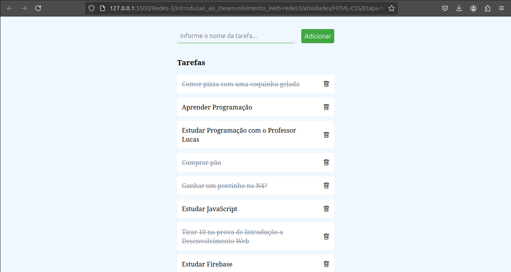
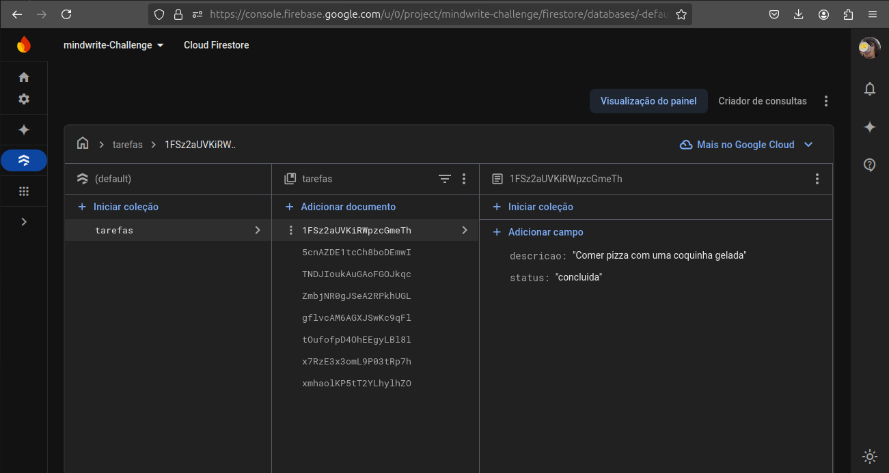

# 📝 To-Do List Application

Uma simples aplicação de lista de tarefas, onde você pode adicionar, marcar como concluída e excluir tarefas. A aplicação utiliza o **Firebase Firestore** para armazenar os dados em tempo real, permitindo que suas tarefas sejam salvas e exibidas imediatamente.

---

## 🚀 Como Rodar o Projeto

### Passo a Passo para Configurar o Firebase

Para que você consiga testar a aplicação localmente, será necessário configurar o Firebase corretamente e gerar suas próprias credenciais.

### 🛠️ **Passo 1: Criar um Projeto no Firebase**

1. Acesse [Firebase Console](https://console.firebase.google.com/).
2. Clique em **"Adicionar projeto"** e siga as instruções para criar um novo projeto.
3. **Nome do projeto**: Escolha um nome de sua preferência (exemplo: `to-do-list-app`).
4. **Configuração do Google Analytics**: Você pode desabilitar essa opção.
5. Conclua a criação do projeto.

### 🗃️ **Passo 2: Habilitar o Firestore**

1. No painel do Firebase, vá para **Firestore Database**.
2. Clique em **Criar banco de dados**.
3. Selecione o **modo de produção** para criar seu banco de dados (você pode definir as regras de segurança mais tarde).
4. No modo de teste, as regras são abertas para qualquer leitura/gravação, permitindo que você faça testes.

**Exemplo de regras básicas de segurança:**

```json
service cloud.firestore {
  match /databases/{database}/documents {
    match /{document=**} {
      allow read, write: if request.auth != null;
    }
  }
}
```

### 🔑 **Passo 3: Obter Suas Credenciais do Firebase**

1. No painel do Firebase, clique em **Configurações do projeto** (ícone de engrenagem no canto superior esquerdo).
2. Vá até **Suas apps** e clique em **Web** para criar as credenciais de uma aplicação web.
3. Copie o código gerado contendo suas credenciais (`apiKey`, `authDomain`, `projectId`, etc.).

### ⚙️ **Passo 4: Configurar o Firebase no Seu Projeto**

1. Crie o arquivo `firebase.js` e adicione as credenciais copiadas.

Exemplo de configuração:

```javascript
import { initializeApp } from "https://www.gstatic.com/firebasejs/11.0.2/firebase-app.js";
import { getFirestore } from "https://www.gstatic.com/firebasejs/11.0.2/firebase-firestore.js";

// Suas credenciais do Firebase
const firebaseConfig = {
  apiKey: "SUA_API_KEY",
  authDomain: "SEU_AUTH_DOMAIN",
  projectId: "SEU_PROJECT_ID",
  storageBucket: "SEU_STORAGE_BUCKET",
  messagingSenderId: "SEU_MESSAGING_SENDER_ID",
  appId: "SEU_APP_ID",
  measurementId: "SEU_MEASUREMENT_ID"
};

// Inicializa o Firebase
const app = initializeApp(firebaseConfig);
const db = getFirestore(app);

export { db };
```

2. **Importe o arquivo `firebase.js`** nos outros arquivos, como `script.js`, para conectar a aplicação ao Firestore.

### 💻 **Passo 5: Rodar a Aplicação**

1. Se estiver utilizando um servidor local (ex: `live-server`), basta abrir o arquivo `index.html`.
2. A aplicação já estará funcional, e você poderá adicionar, editar e excluir tarefas.

---

## 🚨 **Importante**

- **Não compartilhe suas credenciais Firebase publicamente**. Se for necessário enviar o código para repositórios públicos, **utilize variáveis de ambiente** para manter as credenciais seguras.
- Para variáveis de ambiente em **React**, por exemplo, você pode adicionar as credenciais no arquivo `.env`.

**Exemplo de arquivo `.env`:**

``` REACT_APP_API_KEY=SUA_API_KEY
REACT_APP_AUTH_DOMAIN=SEU_AUTH_DOMAIN
REACT_APP_PROJECT_ID=SEU_PROJECT_ID
REACT_APP_STORAGE_BUCKET=SEU_STORAGE_BUCKET
REACT_APP_MESSAGING_SENDER_ID=SEU_MESSAGING_SENDER_ID
REACT_APP_APP_ID=SEU_APP_ID
REACT_APP_MEASUREMENT_ID=SEU_MEASUREMENT_ID
```

---

## 📂 **Estrutura do Projeto**

- **`index.html`**: A interface da aplicação.
- **`script.js`**: O arquivo JavaScript que contém a lógica da aplicação (adicionar, excluir, listar tarefas).
- **`firebase.js`**: Arquivo que configura a conexão com o Firebase.
- **`README.md`**: Documentação do projeto.

---

## ✨ **Funcionalidades**

- **Adicionar tarefa**: Insira a descrição da tarefa e adicione-a à lista.
- **Excluir tarefa**: Remova tarefas da lista.
- **Marcar como concluída**: Clique na tarefa para alternar entre "pendente" e "concluída".
- **Atualização em tempo real**: A lista de tarefas é automaticamente atualizada em todos os dispositivos conectados, graças ao Firestore.

---

## 💬 **Feedback e Contribuições**

Sinta-se à vontade para enviar feedback, sugestões de melhorias ou contribuir com o projeto! 🚀

---

### 👨‍💻 **Tecnologias Usadas**

- **Firebase Firestore**: Banco de dados em tempo real.
- **HTML/CSS/JavaScript**: Frontend da aplicação.

---

## 📝 **Licença**

Este projeto é de código aberto e pode ser usado, modificado e distribuído conforme a licença.

---

## 📸 **Imagens da Aplicação**



