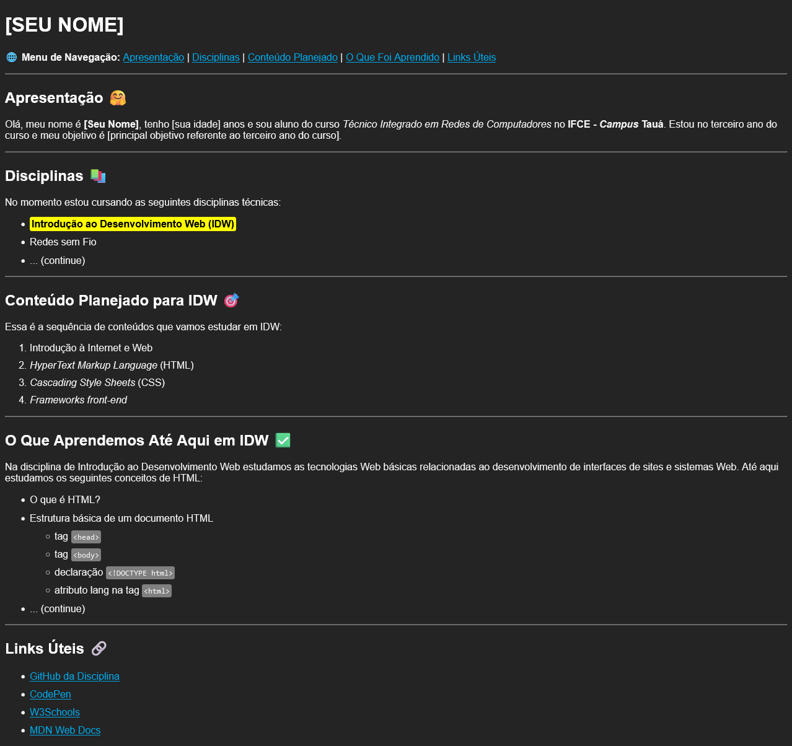

# Atividade Prática 03: CSS básico

> Nesta atividade vamos trabalhar os conceitos básicos de aplicação de CSS em páginas Web

[Acesse aqui](./../../../exemplos/HTML-CSS/ex05/) o exemplo trabalhado em aula sobre CSS básico.
[Acese aqui](https://classroom.google.com/c/NjU2Njk1Njk1MDkz/m/NjY2MjIwNjc2ODEz/details) o material complementar sobre CSS.

## Instruções para Realização da Atividade

- Esta atividade tem o objetivo de exercitar a aplicação básica de CSS em páginas Web.

- A atividade consiste em aplicar regras CSS básicas, aprendidas em aula (cores, espaçamentos e bordas), na página criada na [atividade 02](./../atv02/). O resultado deve ficar semelhante ao apresentado na imagem a seguir:

    

- **Instruções e Requisitos básicos para avaliação:**

    - Todas as estilizações referentes à formatação básica de textos devem ser aplicadas usando CSS. Exemplo: ao invés de usar a tag `b` para aplicar negrito em um texto, utilize a propriedade CSS `font-weight` com o valor `bold`;
    - Perceba que em todos os exemplos de tags citadas na página, um destaque foi aplicado com uma cor de plano de fundo e bordas arredondadas, bem como no destaque do nome da disciplina;
    - Os links também foram definidos com uma cor diferente da cor padrão;
    - Sintam-se livres para utilizar outras cores, porém tentem manter um bom contraste visual. Utilizem o site [CorHexa](https://corhexa.com/verificador-contraste) para fazer a verificação de contraste;
    - ***Você DEVE utilizar CSS externo***;
    - **Coloque o código da atividade no seu GitHub e entregue o link pelo Classroom**.
