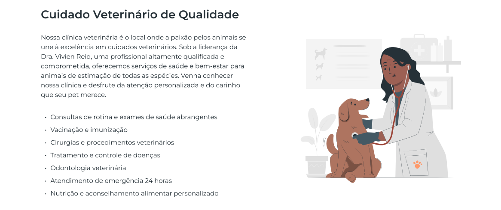
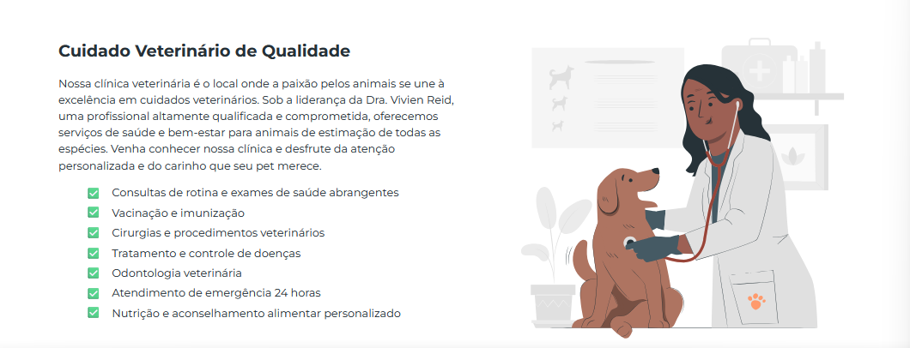
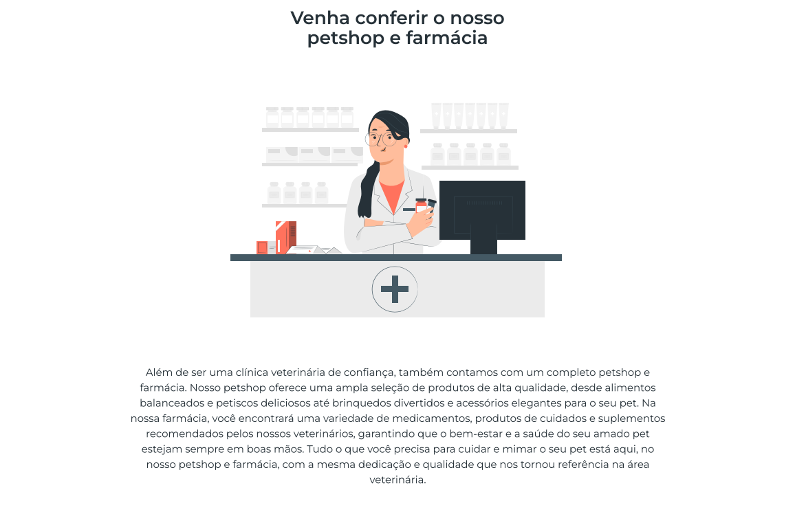
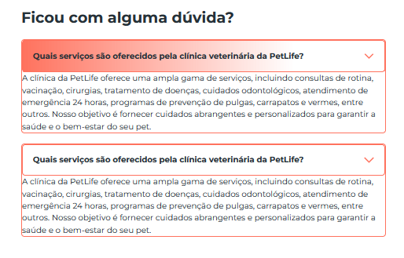
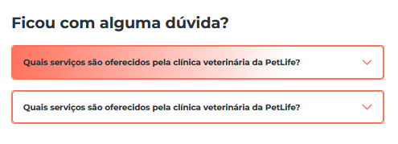

# Introdução ao Desenvolvimento Web - Redes 3

## Roteiro da Prática 07

> **_Prática 07_** - _Página Institucional: (Parte 02) Seções de Clínica, Farmácia e Dúvidas Frequentes_
>
> - **Objetivo:** implementar as demais seções da página inicial do projeto: Clínica, Farmácia e Dúvidas Frequentes.
> - **Observações e Instruções Gerais:**
>
>   - Tente seguir o roteiro desta prática de forma a entender cada passo.
>   - Caso fique com alguma dúvida, fique à vontade para perguntar.
>   - Os arquivos necessários para a realização desta prática, estão na pasta [recursos](recursos) (imagens, protótipo e textos utilizados).
>   - Vocês deverão utilizar o VS Code ou alguma plataforma online, como o [CodeSandBox](https://codesandbox.io) que possui uma interface similar ao VS Code e permite estruturar nosso projeto, fazer upload dos recursos necessários.
>
>   - ❗ A implementação base do projeto, até o momento, encontra-se no CodeSandbox, [neste link](https://codesandbox.io/p/sandbox/3pz7vf).
>     - Acesse o link acima e faça um fork do projeto para sua conta, ou baixe os arquivos e trabalhe offline com o VS Code.
>     - Nessa versão, já estam sendo aplicadas Media Queries para dar responsividade à barra de navegação e à seção hero (como implementamos nas últimas aulas).

### 1. Apresentação da Prática

- Esta prática tem o objetivo de implementar as demais seções do projeto do site institucional PetLife usando os conhecimentos aprendidos até aqui, além de novos conceitos e propriedades apresentados ao decorrer desta prática.

- Vamos construir as seções "Clínica", "Farmácia" e "Dúvidas Frequentes".

  - Veja como deve ficar essas seções no arquivo de protótipo do projeto, [neste link](recursos/petlife-project.pdf).

- O que vamos aplicar nesta prática?

  - Flexbox para a estruturação e posicionamento dos elementos
  - Box Model CSS
  - Elementos semânticos
  - Imagens
  - Responsividade e Media Queries
  - Aplicação básica de JavaScript para construção de um Menu Accordion (na seção de dúvidas frequentes)

### 2. Criação da Seção Clínica

1. Inicialmente, precisamos entender a estrutura necessária para a seção Clínica. Para isso, vamos dar uma olhada em como essa seção foi projetada:
   

1. Podemos perceber que a estrutura da seção Clínica é similar à estrutura da seção hero: conteúdo textual ao lado de uma imagem. Porém, nesta seção a imagem é posicionada à direita do conteúdo textual.

1. De forma similar ao que fizemos na estrutura da seção hero, vamos criar um elemento `section` e aplicar as classes `clinica-section` e `content-center`, bem como o ID `clinica` (para vincular com o link correspondente no menu).

   ```html
   <section class="clinica-section content-center" id="clinica"></section>
   ```

   - A classe `content-center` já foi estilizada na prática anterior, para alinhar o contêiner interno da seção (conteúdo) ao centro.
   - A classe `clinica-section` foi criada para que, caso necessário, possamos aplicar estilos específicos para esta seção.

1. Dentro do elemento `section` vamos criar uma `div` com a classe `container-limiter` para ser nosso contêiner limitador para o conteúdo (assim como fizemos para a seção hero).

   ```html
   <section class="clinica-section content-center" id="clinica">
     <div class="container-limiter"></div>
   </section>
   ```

1. Agora vamos, de fato, definir o conteúdo interno da seção.

   - Primeiro, vamos criar uma `div` com a classe `content-tex` para ser nosso contêiner para o conteúdo textual. Dentro dela, vamos definir o título da seção, um parágrafo com o texto da seção e uma lista não ordenada para os serviços oferecidos.
   - Depois, vamos inserir a imagem para a seção.

   ```html
   <section class="clinica-section content-center" id="clinica">
     <div class="container-limiter">
       <div class="content-text">
         <h2>Cuidado Veterinário de Qualidade</h2>
         <p>
           Nossa clínica veterinária é o local onde a paixão pelos animais se
           une à excelência em cuidados veterinários. Sob a liderança da Dra.
           Vivien Reid,uma profissional altamente qualificada e comprometida,
           oferecemos serviços de saúde e bem-estar para animais de estimação de
           todas as espécies. Venha conhecer nossa clínica e desfrute da atenção
           personalizada e do carinho que seu pet merece.
         </p>

         <ul class="lista-servicos">
           <li>Consultas de rotina e exames de saúde abrangentes</li>
           <li>Vacinação e imunização</li>
           <li>Cirurgias e procedimentos veterinários</li>
           <li>Tratamento e controle de doenças</li>
           <li>Odontologia veterinária</li>
           <li>Atendimento de emergência 24 horas</li>
           <li>Nutrição e aconselhamento alimentar personalizado</li>
         </ul>
       </div>

       
     </div>
   </section>
   ```

   - Veja que atribuímos uma classe `lista-servicos` para a lista não ordenada. Vamos utilizá-la no CSS para estilizar os itens dessa lista.

1. Agora vamos à estilização dos elementos da seção Clínica.

   - A estilização desta seção será bem simples. Basicamente, vamos: alterar os marcadores da lista e aplicar um espaçamento entre um item e outro.
   - No arquivo `home.css`, insira as seguintes regras ao final dele:

     ```css
     .lista-servicos li {
       list-style: none;
       margin-bottom: 0.5rem;
     }

     .lista-servicos li::before {
       content: "\2705";
       display: inline-block;
       margin-right: 1rem;
     }
     ```

   - Explicando:
     - Primeiro, selecionamos os itens da lista de serviços para retirar o marcador padrão e para aplicar uma margem inferior de `0.5rem` (para distanciar um item do outro).
     - Depois, usamos o seletor com o pseudo-elemento `::before`, no item da lista, para criar um conteúdo a ser apresentado antes do elemento `li` (item da lista). Então, definimos um emoji como conteúdo (esse emoji: ✅), mudamos o `display` para `inline-block` (para permitir aplicar margens) e, por último, aplicamos um espaçamento maior do emoji em relação ao texto (margem à direita).

1. O resultado final será esse:
   

### 3. Criação da Seção Farmácia

1. Inicialmente, vamos entender a estrutura necessária para a seção Farmácia. Para isso, vamos dar uma olhada em como essa seção foi projetada:
   

   - Perceba que agora, temos uma estrutura diferente: a imagem aparece acima do texto, precedida pelo título.

1. Voltando ao arquivo `index.html`, vamos criar um novo elemento `section`, agora com as classes `farmacia-section` e `content-center`, bem como com o ID `farmacia`. Dentro dela, já vamos definir o nosso contêiner limitador de largura (`div` com a classe `conatainer-limiter`).

   ```html
   <section class="farmacia-section content-center" id="farmacia">
     <div class="container-limiter"></div>
   </section>
   ```

1. Agora, vamos dividir a estrutura interna dessa seção em dois elementos: um contêiner para o título e a imagem e um contêiner para o conteúdo textual (com a classe `content-text`, já definida).

   ```html
   <section class="farmacia-section content-center" id="farmacia">
     <div class="container-limiter">
       <div>
         <h2>Venha conferir o nosso petshop e farmácia</h2>
         
       </div>

       <div class="content-text">
         <p>
           Na nossa farmácia, você encontrará uma variedade de medicamentos,
           produtos de cuidados e suplementos recomendados pelos nossos
           veterinários, garantindo que o bem-estar e a saúde do seu amado pet
           estejam sempre em boas mãos. Tudo o que você precisa para cuidar e
           mimar o seu pet está aqui, no nosso petshop e farmácia, com a mesma
           dedicação e qualidade que nos tornou referência na área veterinária.
         </p>
       </div>
     </div>
   </section>
   ```

1. A estilização dessa seção também será muito simples, consistindo basicamente em alterar a direção do eixo do contêiner onde o flexbox está aplicado (classe `container-limiter`), para fazer o conteúdo aparecer um abaixo do outro.

   - Além disso, devemos centralizar o conteúdo textual e permitir que ele ocupe uma largura maior (para aproveitar melhor o espaço disponível).
   - As regras a seguir, que aplicam essas estilizações, devem ser inseridas ao final do arquivo `home.css`:

   ```css
   .farmacia-section .container-limiter {
     flex-direction: column;
   }

   .farmacia-section .content-text {
     text-align: center;
     width: 80%;
   }
   ```

### 4. Criação da Seção Dúvidas Frequentes

#### 4.1. Definição da Estrutura

1. Vamos analisar como a seção Dúvidas está estrutura:
   

1. De forma geral, a estrutura base dessa seção é a mesma das demais: uma `section` com a classe específica da seção e com a classe `content-center`; dentro dessa section, nosso limitador de largura (`container-limiter`) e, internamente, a imagem da seção e uma `div` para conteúdo textual.
    ```html
    <section class="duvidas-section content-center" id="duvidas">
        <div class="container-limiter">
            

          <div class="content-text">
            
          </div>
        </div>
    </section>
    ```

1. Dentro da div de conteúdo textual (classe `content-text`), a estrutura será um pouco mais complexa. Precisamos definir a estrutura para as perguntas e respostas de modo a possibilitar a expansão e o recolhimento de cada caixa de pergunta.
    - Chamamos esse tipo de componente de Menu Accordion, ou grupo recolhível.
    - A ideia é que o usuário possa acessar a resposta à uma pergunta clicando sobre ela e, ao clicar novamente, a resposta será recolhida.

1. Inicialmente, precisamos definir um título para a seção e um contêiner para o menu acoordion com as dúvidas (com a classe `duvidas-container`).
    ```html
    ...
    <div class="content-text">
        <h2>Ficou com alguma dúvida?</h2>

        <div class="duvidas-container">

        </div>
    </div>
    ...
    ```

1. Agora, vamos definir a estrutura base para cada dúvida. A ideia é ter um contêiner geral para a dúvida e, internamente, um contêiner para a pergunta e um parágrafo para a resposta. Além disso, dentro do contêiner da pergunta, vamos definir um título de menor nível (`h3`) para a pergunta em sí e uma imagem (com o ícone de seta).
    ```html
    ...
    <div class="duvidas-container">

        <div class="duvida">
            <div class="duvida-title">
                <h3>
                  Quais serviços são oferecidos pela clínica veterinária da
                  PetLife?
                </h3>
                
            </div>

            <p class="resposta">
              A clínica da PetLife oferece uma ampla gama de serviços,
              incluindo consultas de rotina, vacinação, cirurgias,
              tratamento de doenças, cuidados odontológicos, atendimento de
              emergência 24 horas, programas de prevenção de pulgas,
              carrapatos e vermes, entre outros. Nosso objetivo é fornecer
              cuidados abrangentes e personalizados para garantir a saúde e
              o bem-estar do seu pet.
            </p>
        </div>

    </div>
    ...
    ```
    - Perceba que colocamos algumas classes nessa estrutura: a classe `duvida` para definir os estilos para o contêiner geral da dúvida (pergunta + resposta); a classe `duvida-title` para os estilos do título da pergunta; e a classe `resposta` para a estilização do parágrafo com a resposta.
  
1. Vamos criar pelo menos duas perguntas para a nossa seção de Dúvidas. O código final dessa seção será o seguinte:
    ```html
    <section class="duvidas-section content-center" id="duvidas">
          <div class="container-limiter">

              

              <div class="content-text">

                <h2>Ficou com alguma dúvida?</h2>

                <div class="duvidas-container">

                    <div class="duvida">
                        <div class="duvida-title">
                            <h3>
                              Quais serviços são oferecidos pela clínica veterinária da
                              PetLife?
                            </h3>
                            
                        </div>

                        <p class="resposta">
                          A clínica da PetLife oferece uma ampla gama de serviços,
                          incluindo consultas de rotina, vacinação, cirurgias,
                          tratamento de doenças, cuidados odontológicos, atendimento de
                          emergência 24 horas, programas de prevenção de pulgas,
                          carrapatos e vermes, entre outros. Nosso objetivo é fornecer
                          cuidados abrangentes e personalizados para garantir a saúde e
                          o bem-estar do seu pet.
                        </p>
                    </div>

                    <div class="duvida">
                        <div class="duvida-title">
                            <h3>
                              Quais serviços são oferecidos pela clínica veterinária da
                              PetLife?
                            </h3>
                            
                        </div>

                        <p class="resposta">
                          A clínica da PetLife oferece uma ampla gama de serviços,
                          incluindo consultas de rotina, vacinação, cirurgias,
                          tratamento de doenças, cuidados odontológicos, atendimento de
                          emergência 24 horas, programas de prevenção de pulgas,
                          carrapatos e vermes, entre outros. Nosso objetivo é fornecer
                          cuidados abrangentes e personalizados para garantir a saúde e
                          o bem-estar do seu pet.
                        </p>
                    </div>

                  </div>

              </div>

          </div>
      </section>
    ```

#### 4.2. Estilização da Seção Dúvidas

1. Agora vamos trabalhar no arquivo `home.css` para estilizar essa seção.

1. Primeiro, vamos alinhar os elementos do contêiner geral da seção (`container-limiter`) verticalmente no topo.
    ```css
    .duvidas-section .container-limiter {
        align-items: flex-start;
    }
    ```

1. Agora, estilizando especificamente nosso Menu Acoordion com as dúvidas, vamos fazer com que as dúvidas apareçam uma abaixo da outra. Para isso vamos aplicar flexbox com a direção de coluna dentro do contêiner das dúvidas (o que envolve todas as caixas de dúvidas).
    ```css
    .duvidas-container {
        display: flex;
        flex-direction: column;
        gap: 1rem;
    }
    ```

1. Para cada dúvida, vamos estilizar seu contêiner de modo a definir uma borda com a cor principal do site e um arredondamento nas bordas.
    ```css
    .duvida {
        border: 1px solid var(--primary-color);
        border-radius: 4px;
    }
    ```

1. Vamos estilizar de forma básica os elementos de texto dentro de cada dúvida (titulo `h3` e o parágrafo).
    ```css
    .duvida h3, .duvida p {
      font-size: 0.8rem;
      margin: 0;
    }
    ```

1. Para o título da dúvida (que vai ser a área clicável), vamos definir os seguintes estilos:
    ```css
    .duvida-title {
        display: flex;
        justify-content: space-between;
        align-items: center;
        border: 1px solid var(--primary-color);
        padding: 16px;
        border-radius: 4px;
        cursor: pointer;
    }
    ```
    - Utilizamos o flexbox para posicionar o título da pergunta (`h3`) ao lado da imagem de seta.
    - Definimos uma borda também para a caixa do título da dúvida.
    - Definimos um preenchimento interno entre a borda e o conteúdo (com `padding`) e um arredondamento das bordas.
    - Por fim, definimos o cursor como `pointer` para indicar ao usuário que essa é uma área clicável.
  
1. Se você estiver acompanhando o resultado a cada passo, já percebeu que a imagem da seta tem um tamanho muito grande e desproporcional. Vamos corrigir isso agora.
    ```css
    .duvida-title img {
        width: 16px;
    }
    ```

1. Ainda em relação à estilização do contêiner do título da dúvida, vamos adicionar um efeito bem legal ao passar o mouse por cima. Vamos aplicar um gradiente usando a cor primária do site, que deve aparecer quando o usuário mover o mouse por cima da caixa da pergunta.
    ```css
    .duvida-title:hover {
        background-image: linear-gradient(to right, var(--primary-color) 0%, transparent 75%);
    }
    ```
    - Até aqui, temos o seguinte resultado:
        

1. Para finalizar, vamos estilizar o parágrafo com a resposta da dúvida, fazendo com que ele não apareça inicialmente.
    ```css
    .resposta {
        padding: 0;
        height: 0;
        overflow: hidden;
        opacity: 0;
        transition: all 0.3s;
    }
    ```
    - Zeramos padding, altura e opacidade e definimos a propriedade `overflow` como `hidden` para não haver transbordamento do texto para fora da caixa do parágrafo.
    - Além disso, definimos a duração de qualquer transição nesse elemento para `0.3s`.
    - O resultado será esse:
        
    
1. Só temos um problema agora: a resposta está escondida e não aparece. É isso que vamos resolver na próxima etapa, para que seja possível expandir ou recolher a caixa de resposta ao clicar no título da dúvida.

### 5. Habilitando Interação com o Menu Accordion

> Ainda não estudamos JavaScript na disciplina, será nosso próximo assunto. Mas, inicialmente, entenda que o **JavaScript** é a **linguagem de programação padrão da Web**. Os códigos escritos em JavaScript são **interpretados pelo navegador** e possibilitam adicionar **comportamentos dinâmicos** à página, prover **interação com o usuário** e **manipular elementos** da página.

1. Para possibilitar o comportamento de expansão e recolhimento das caixas de respostas em nosso menu accordion criado anteriormente, precisaremos aplicar um pouquinho de JavaScript.

1. Para isso, crie um arquivo chamado `main.js` dentro da pasta `js`.
    - Você poderia dar qualquer outro nome para seu arquivo de script, mas vamos usar esse padrão para o script principal.

1. Arquivo de script criado, vamos referenciá-lo em nossa página HTML (arquivo `index.html`).
    - Adicione a seguinte linha dentro da seção `head` do arquivo `index.html`:
        ```html
        <script defer src="./js/main.js"></script>
        ```
    - Usamos a tag `script` quando queremos escrever um código JavaScript ou referenciar um arquivo de código externo.
    - O atributo `src` indica o local do nosso arquivo de script.
    - O atributo `defer` diz para o navegador que ele só deve executar o script quando toda a página estiver carregada.

1. Voltando para o arquivo `main.js`, vamos adicionar o seguinte código:
    ```js
    const elementosDuvida = document.querySelectorAll(".duvida");

    for (let i = 0; i < elementosDuvida.length; i++) {

        elementosDuvida[i].addEventListener("click", 
            function () {
                elementosDuvida[i].classList.toggle("ativa");
            }
        );

    }
    ```

1. ❗ **IMPORTANTE**: Se você testar agora, ainda não vai funcionar, mas se acalme que já já a gente resolve. **Primeiro vamos entender o código criado:**
    - `const elementosDuvida = document.querySelectorAll(".duvida");`
        - Aqui estamos pegando todos os elementos do documento que tenham a classe `.duvida` e guardando eles em um array (vetor) chamado `elementosDuvida`
      
    - `for (let i = 0; i < elementosDuvida.length; i++) { ... }`
        - Agora precisamos percorrer todos os elementos do array para adicionar uma ação que vai ser executada quando o elemento sofrer um clique.
    
        ```js
        elementosDuvida[i].addEventListener("click", 
            function () {
                elementosDuvida[i].classList.toggle("ativa");
            }
        );
        ```
        - Para cada elemento do aray (`elementosDuvida[i]`) estamos adicionando um evento (`addEventListener`) de clique.
        - Além disso, estamos definindo uma função (ação) que vai ser executada quanso houver um evento de clique nesse elemento.
        - `elementosDuvida[i].classList.toggle("ativa");`
            - Esse trecho faz o milagre acontecer 😅. Aqui, nós estamos pegando a lista de classes aplicadas ao elemento e alternando a aplicação da classe `ativa`.
            - **Assim, quando você clicar a primeira vez, ele adiciona a classe `ativa` no elemento da caixa de dúvida. Se você clicar novamente, ele retira essa classe.**

1. Você deve ter percebido que nós não temos essa classe `ativa` estilizada no nosso CSS. É isso que vamos fazer agora.
    - Vá ao arquivo `home.css` e adicone a seguinte regra:
        ```css
        .duvida.ativa .resposta {
            padding: 16px;
            height: fit-content;
            opacity: 1;
        }
        ```
    - Explicando:
        - Estamos selecionando o parágrafo de resposta que estiver dentro de um elemento que tenha a classe `duvida` e **também** a classe `ativa` (`.duvida.ativa`).
        - Ou seja, se o contêiner da dúvida tiver a classe `ativa` atribuída, essas estilizações serão aplicadas, fazendo a resposta ser exibida.
        - Quando a classe `ativa` for retirada do elemento, a estilização padrão será aplicada (a que nós já definimos anteriormente e que esconde a resposta).

7. Pronto!!! Agora é só testar o resultado!