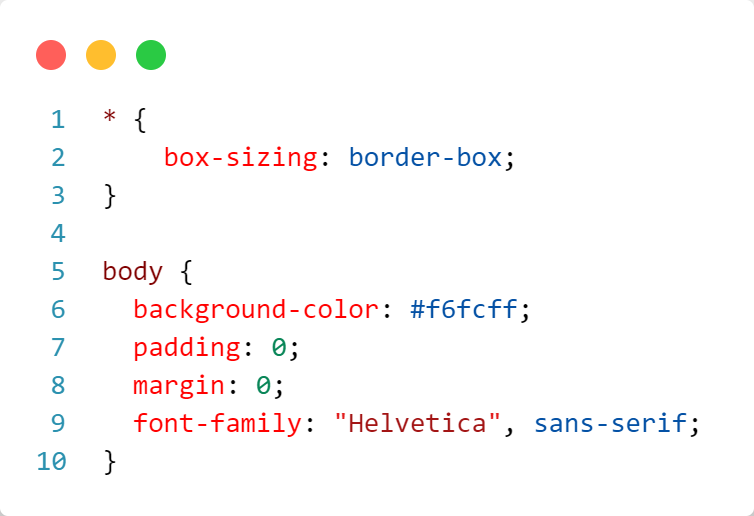

# Atividade Prática 05: Estilização de Formulários

## Correção da Prática

> A atividade prática 05 teve como objetivo realizar a estilização de um formulário de cadastro de usuários de um sistema web hipotético. A atividade trabalhou os conceitos de:
> - definição de formulários HTML
> - cores e backgrounds
> - tipografia CSS
> - modos de exibição e propriedade display
> - box-model CSS

- [Acesse aqui](https://classroom.google.com/c/NjU2Njk1Njk1MDkz/a/NzA3Nzc2MDg4OTA1/details) a descrição da atividade no Classroom da disciplina.
- [Acese aqui](https://codepen.io/prof_lucasmendes/pen/wvLxQPe) o código HTML para a resolução da atividade.

## Instruções para Realização da Atividade

- A atividade consistiu em construir e estilizar um formulário de cadastro, como exemplificado na imagem abaixo:

    

### Passo a passo:

1. Primeiro, acesse o código HTML base para a resolução desta atividade [neste link](https://codepen.io/prof_lucasmendes/pen/wvLxQPe)

1. Faça um `fork` do código para sua conta (essa opção se encontra na parte inferior direita da página de edição do CodePen) ou crie um projeto no VS Code e copie o código HTML no arquivo index.html

1. Perceba que no código HTML, na definição dos campos de entrada do formulário, a tag `label` foi usada para envolver as tags `span` (con o rótulo do campo) e as tags `input`/`textarea` (definindo o campo de entrada), como a seguir. Fazendo dessa forma, não é necessário fazer o vínculo do atributo `for` da tag `label` com o atributo `id` da tag `input`. Além disso, conseguimos agrupar o rótulo e o campo de entrada de forma a facilitar nossa estilização no CSS.

    

        
    

1. Use o campo de edição do CSS no CodePen ou crie um arquivo `style.css` no VS Code (o que for usar) para colocar as regras CSS explicadas a seguir.

1. Primeiramente vamos às estilizações gerais da página:
    - Usando o seletor universal `*` aplicamos a propriedade `box-sizing: border-box` para todos os elementos da página a fim de evitar problemas de dimensionamento dos elementos
    - No `body`, definimos a cor de plano de fundo para `#f6fcff`, zeramos qualquer padding e margem que o navegador tenha definido por padrão e definimos a fonte do texto como `Helvetica`

    

        
    

1. Depois vamos estilizar a `div` de classe `register`, que é o nosso container para o formulário, da seguinte forma:
    - Alinhamos todo o texto dentro do container (o título `h1` e o parágrafo) ao centro
    - Mudamos a cor do parágrafo para `#aaa`

    

        
    

1. Agora vamos estilizar o nosso formulário, de forma geral, somente definindo uma largura máxima de 50% do container e centralizando ele na página com `margin: 0 auto` (o valor 0 será aplicado às margens superior e inferior e o valor `auto` (*automático*) será aplicado às laterais, o que faz o elemento ficar centralizado na horizontal)

    

        
    

1. Seguindo, vamos começar a estilização dos elementos interno do formulário, pelos rótulos e agupamentos criados pela tag `label`
    - Inicialmente definimos o modo de exibição das tags `label` como `block`, fazendo com que o agrupamento `rótulo + campo` sejam exibidos em coluna (um abaixo do outro)
    - Então, dfinimos uma margem inferior de `1rem` para a tag `label`, separando os agrupamentos de rótulo e campo
    - Após isso, com o seletor `label > *`, selecionamos todos os elementos dieretamente filhos da tag `label`, ou seja, os elementos `span` (com o texto do rótulo) e os elementos `input/textarea`. Então, definimos o modo de exibição para `block`
    - Por fim, estilizamos o texto do rótulo (dentro da tag `span`) aplicando uma margem inferior, um estilo negrito e alinhando o texto à esquerda

    

        
    

1. Agora vamos para a estilização dos campos de entrada (`input` e `textarea`)
    - Primeiro retiramos todas as bordas do elemento e aplicamos somente a borda inferior com a cor `#ccc`
    - Então, aplicamos um `padding` de `0.8rem` das bordas superior e inferior e `0rem` para as laterais
    - Definimos a cor de plano de fundo dos elementos de entrada como `trasparent` (transparente)
    - Por fim, fazemos os campos de entrada serem definidos com largura de 100% do formulário

    

        
    

1. Continuando com as estilizações dos campos de entrada, vamos definir regras CSS para partes e estados especiais desses campos
    - Primeiro, usamos o **pseudo-seletor** `::placeholder` tanto no elemento `input` como no `textarea` para selecionar apenas o texto de placeholder que foi definido no HTML
    - Aplicamos então uma fonte `Helvetica` e a cor `#aaa` para o placeholder dos campos
    - Depois, usando o **pseudo-seletor** `:focus` podemos definir regras específicas que serão aplicadas somente quando o campo estiver em foco (quando o usuário clicar no campo). A única coisa que faremos aqui é aplicar a regra `outline: none` para retirar qualquer realce que o navegador coloque no campo quando ele estiver em foco

    

        
    

1. Agora vamos partir para a estilização do botão de submit, no qual definimos uma classe `btn` lá no código HTML (verifiquem)
    - Aqui fazemos uma série de estilizações, definindo inicialmente a cor de plano de fundo, cor do texto e o alinhamento do texto
    - Com a regra `cursor: pointer` definimos o tipo de ponteiro do mouse que será exibido quando o usuário passá-lo por cima do botão de cadastrar
    - Depois, definimos um leve arredondamento das bordas, a largura do botão e o texto em negrito
    - Por fim, retiramos todas as bordas, definimos um padding (para dar uma "encorpada" rsrs) e definimos o tamanho do texto para `1rem`

    

        
    

1. Por último, vamos definir um efeito simples que ocorrerá qaundo o usuário passar o mouse por cima do botão de cadastrar
    - Usamos o **pseudo-seletor** `:hover` para essa finalidade (aplicar regras CSS somente quando o elemento estiver sob foco do ponteiro do mouse)
    - Definimos então uma cor de plano de fundo ligeiramente diferente e mantemos a cor do texto como branca

    

        
    

