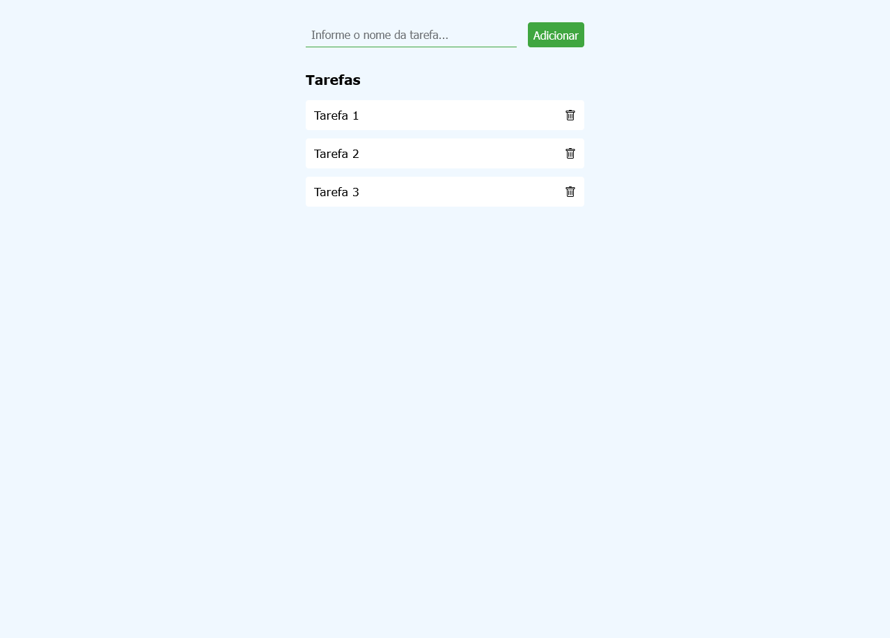

# Roteiro de Prática - Lista de Tarefas (To-Do List)

Neste tutorial, vamos criar uma aplicação simples de lista de tarefas (To-Do List) usando HTML, CSS e JavaScript. O objetivo é ensinar como manipular o DOM e utilizar eventos para criar uma aplicação interativa. Vamos implementar recursos de adição, marcação de conclusão e exclusão de tarefas. Siga o passo a passo!

## Resultado Final Esperado

  

---

## Estrutura do Projeto

- **index.html**: Estrutura HTML da aplicação.
- **index.css**: Estilos para tornar a lista visualmente agradável.
- **script.js**: Lógica de manipulação de DOM e eventos em JavaScript.

---

## 1. Estrutura Básica do HTML

Começaremos criando a estrutura HTML da nossa aplicação, com um campo de entrada, um botão
de adicionar e uma lista onde as tarefas serão exibidas.

### Código HTML:

```html
<!DOCTYPE html>
<html lang="pt-BR">
  <head>
    <meta charset="UTF-8" />
    <meta name="viewport" content="width=device-width, initial-scale=1.0" />
    <title>To-Do List</title>
    <link rel="stylesheet" href="index.css" />
    <script src="script.js" defer></script>
  </head>
  <body>
    <div class="container">
      <div class="entrada">
        <input
          type="text"
          placeholder="Informe o nome da tarefa..."
          id="campoEntrada"
        />
        <button id="btnAdicionar">Adicionar</button>
      </div>

      <div>
        <h3>Tarefas</h3>
        <ul id="listaTarefas"></ul>
      </div>
    </div>
  </body>
</html>
```

> **Explicação**: Aqui, temos um campo de entrada (`<input>`), um botão de adicionar (`<button>`) e uma lista (`<ul>`) onde as tarefas serão exibidas. Os `IDs` atribuídos facilitarão a manipulação desses elementos a partir do JavaScript.

> 🚨❓ **Questão 01**
> *- O que precisamos fazer para adicionar um script na seção `<head>` de uma página HTML e definir que ele só deve ser executado ao finalizar o carregamento da página?*

## 2. Estilo Visual com CSS

Agora, vamos estilizar nossa lista de tarefas para deixá-la visualmente agradável. Vamos adicionar estilos para o layout, botões e a aparência das tarefas concluídas.

1. Crie um arquivo chamado `index.css`.
1. Adicione o estilo básico, incluindo um estilo para tarefas concluídas e para o efeito de erro.

### Código CSS (index.css):

```css
@import url("https://cdn.jsdelivr.net/npm/bootstrap-icons@1.11.3/font/bootstrap-icons.min.css");

* {
  box-sizing: border-box;
}

body {
  padding: 0;
  margin: 0;
  height: 100vh;
  width: 100vw;
  font-family: Verdana;
  display: flex;
  justify-content: center;
  background-color: #f0f8ff;
}

.container {
  width: 400px;
  margin-top: 2rem;
  display: flex;
  flex-direction: column;
  row-gap: 1rem;
}

.entrada {
  display: flex;
  width: 100%;
  gap: 1rem;

  & > * {
    padding: 0.5rem;
    font-size: 1rem;
  }

  & input {
    flex: 1;
    border: none;
    border-bottom: 1px solid #40a640;
    outline: none;
    background-color: transparent;
  }

  & button {
    background-color: #40a640;
    color: #ffffff;
    border: none;
    cursor: pointer;
    border-radius: 4px;

    &:hover {
      background-color: #59b959;
    }
  }
}

#listaTarefas {
  width: 100%;
  margin: 0;
  padding: 0;
  list-style: none;
  display: flex;
  flex-direction: column;
  row-gap: 12px;

  & button {
    all: unset;
  }

  & li {
    cursor: pointer;
    display: flex;
    background-color: #ffffff;
    border-radius: 4px;

    & span {
      flex: 1;
      padding: 12px;
    }

    & i {
      padding: 12px;
      border-radius: 4px;
    }

    & i:hover {
      background-color: #dc143c;
      color: #ffffff;
    }
  }

  & li:hover {
    background-color: #d4dce2;
  }
}

span.concluida {
  text-decoration: line-through;
  color: #778899;
}

#campoEntrada.input-erro {
  border-bottom: 1px solid #dc143c;
  background-color: #ffe5e5;
}
```
> **Explicação**: Este código CSS utiliza a biblioteca [Bootstrap Icons](https://icons.getbootstrap.com/) para os ícones. Ele também emprega seletores aninhados usando o `&`, uma funcionalidade comum em pré-processadores CSS como Sass, porém já é suportado nativamente pelo CSS. Abaixo está uma explicação detalhada de cada parte.
>
> **Importação da Biblioteca Bootstrap Icons**
> ```css
> @import url("https://cdn.jsdelivr.net/npm/bootstrap-icons@1.11.3/font/bootstrap-icons.min.css");
> ```
>  - Esta linha importa a biblioteca Bootstrap Icons diretamente de um CDN, permitindo o uso de ícones como o de "lixeira" para excluir tarefas. Esse recurso facilita a adição de ícones padrão sem precisar baixar os arquivos localmente.
>
> **Resumo dos Seletores Aninhados com &**
> - O `&` é usado para criar seletores aninhados, permitindo que estilos dependam do contexto onde estão. Ele é substituído pelo seletor pai, facilitando a organização do CSS e a aplicação de estilos condicionais.
> - **Exemplo:** 
> ```css
> .entrada {
>  display: flex;
>  width: 100%;
>  gap: 1rem;
>
>  & > * {
>    padding: 0.5rem;
>    font-size: 1rem;
>  }
>
>  & input {
>    flex: 1;
>    border: none;
>    border-bottom: 1px solid #40a640;
>    outline: none;
>    background-color: transparent;
>  }
> ...
> }
> ```
> - O seletor `& > *` está dentro do contexto do seletor `.entrada`, logo é a mesma coisa que `.entrada > *`. Assim como o seletor `& input`, que tem o mesmo efeito de `.entrada input`.
> - Lembrando que o `>` é um seletor de filho imediato, enquanto o `*` seleciona todos os elementos em um determinado contexto (`.entrada > *` — seleciona todos os elementos que são filhos imediatos do elemento com a classe `entrada`).

---

## 3. Adicionando JavaScript para Manipulação do DOM

Agora vamos criar a lógica da aplicação em JavaScript para adicionar, marcar e remover tarefas.

### Passo a Passo

1. Crie um arquivo chamado `script.js`.
1. Inicialmente vamos selecionar todos os elementos da página que serão manipulados pelo nosso script.

    ```javascript
    const campoEntrada = document.getElementById("campoEntrada");
    const btnAdicionar = document.getElementById("btnAdicionar");
    const listaTarefas = document.getElementById("listaTarefas");
    ```

    > 🚨❓ **Questão 02**
    > *- Considere os métodos de seleção de elementos do DOM (Document Object Model) em JavaScript listados abaixo. 
    > Relacione cada método à definição correta.*
    >
    > - I. document.getElementById()
    > - II. document.querySelector()
    > - III. document.getElementsByTagName()
    >
    > - A. Retorna todos os elementos do DOM que possuem o mesmo nome de tag especificado.
    > - B. Retorna um único elemento do DOM com base no valor do atributo id.
    > - C. Retorna o primeiro elemento do DOM que corresponde ao seletor CSS especificado.

1. Na sequência, vamos definir a função que cria a nova tarefa e adicona na lista de tarefas.

    ```javascript
    ...
    function novaTarefa() {

    }
    ```

1. Vamos, primeiro, obter o texto que o usuário digitou dentro do campo de entrada.
    ```javascript
    ...
    function novaTarefa() {
      const nomeTarefa = campoEntrada.value.trim();
    }
    ```
    > **Explicação**: o método `trim()` permite remover os espaços em branco no início e no final de uma string, garantindo a consistência e a integridade dos dados.

1. Agora precisamos verificar se o usuário digitou realmente alguma coisa, ou o campo está vazio.
    - Caso o campo de entrada esteja vazio, ou somente com espaços em branco, precisamos dar um feedback de erro e não proceder com a inserção da atividade.
    ```javascript
    ...
    function novaTarefa() {
      const nomeTarefa = campoEntrada.value.trim();

      if (nomeTarefa === "") {
        campoEntrada.classList.add("input-erro");
        setTimeout(() => campoEntrada.classList.remove("input-erro"), 1500);
        return;
      }
    }
    ```
    > **Explicação**: estamos adicionando a classe `input-erro` e removendo ela após 1500 ms (1,5 segundos). Essa classe está estilizada no CSS para dar um feedback visual indicando ao usuário que o campo está vazio (volte no CSS para entender o que a aplicação dessa classe faz).

    > 🚨❓ **Questão 03**
    > *- Qual método foi utilizado para adicionar a classe `input-erro` ao campo de entrada no trecho acima? O que é esse atributo `classList`?*

1. Caso o usuário tenha digitado algum texto, vamos proceder com a inserção da tarefa na lista.

    - Primeiro, criamos um novo elemento `li` para ser nosso item da lista de tarefas.
    - Dentro do `li` teremos um `span` (com o texto da tarefa) e um `button` (para definir o botão de exclusão) com um ícone de lixeira.
        - A estrutura de uma tarefa seguirá esse modelo (**NÃO copie esse trecho, é só uma demonstração de como ficará a estrutura HTML**): 
          ```html
          <li>
            <span>Nome da Trefa</span>
            <button><i class='bi bi-trash'></i></button>
          </li>
          ```
        - Logo, precisamos criar esses três elementos.
    
    ```javascript
    ...
    function novaTarefa() {
      const nomeTarefa = campoEntrada.value.trim();

      if (nomeTarefa === "") {
        campoEntrada.classList.add("input-erro");
        setTimeout(() => campoEntrada.classList.remove("input-erro"), 1500);
        return;
      }

      const itemTarefa = document.createElement("li");
      const span = document.createElement("span");
      const btnExcluir = document.createElement("button");

    }
    ```
    > 🚨❓ **Questão 04**
    > *- O que o método `createElement()` faz e que informação ele precisa receber como argumento?*

    - Agora, vamos adicionar o texto que o usuário digitou no campo de entrada ao `span` dentro do item da lista de tarefas. Além disso, vamos inserir um ícone de lixeira no botão de exclusão.

    ```javascript
    ...
    function novaTarefa() {
      const nomeTarefa = campoEntrada.value.trim();

      if (nomeTarefa === "") {
        campoEntrada.classList.add("input-erro");
        setTimeout(() => campoEntrada.classList.remove("input-erro"), 1500);
        return;
      }

      const itemTarefa = document.createElement("li");
      const span = document.createElement("span");
      const btnExcluir = document.createElement("button");

      span.innerText = nomeTarefa;
      btnExcluir.innerHTML = "<i class='bi bi-trash'></i>";
    }
    ```
    > **Explicação rápida**: o trecho `<i class='bi bi-trash'></i>` é defindo pelo Bootstrap Icons, é assim que a biblioteca sabe que queremos inserir um ícone de determinado tipo.

    > 🚨❓ **Questão 05**
    > *- Em JavaScript, ao manipular elementos do DOM, os atributos `innerText` e `innerHTML` são frequentemente utilizados. 
    > Qual das alternativas abaixo descreve corretamente a diferença entre esses dois atributos?*
    >
    > - a — `innerText` somente exibe o conteúdo HTML do elemento, enquanto `innerHTML` somente exibe o texto visível ao usuário.
    > - b — `innerText` retorna ou define apenas o texto visível ao usuário, enquanto `innerHTML` retorna ou define o conteúdo HTML do elemento, incluindo tags.
    > - c — `innerText` é utilizado apenas para leitura, enquanto `innerHTML` pode ser utilizado tanto para leitura quanto para modificação do conteúdo do elemento.
    > - d — Ambos os atributos são sinônimos e podem ser usados de forma intercambiável para manipular texto e HTML.

    - Precisamos agora definir as ações de marcar uma tarefa como concluída e excluir uma tarefa.

    ```javascript
    ...
    function novaTarefa() {
      const nomeTarefa = campoEntrada.value.trim();

      if (nomeTarefa === "") {
        campoEntrada.classList.add("input-erro");
        setTimeout(() => campoEntrada.classList.remove("input-erro"), 1500);
        return;
      }

      const itemTarefa = document.createElement("li");
      const span = document.createElement("span");
      const btnExcluir = document.createElement("button");

      span.innerText = nomeTarefa;
      btnExcluir.innerHTML = "<i class='bi bi-trash'></i>";

      span.onclick = (e) => {
        e.target.classList.toggle("concluida");
      }

      btnExcluir.onclick = (e) => {
        listaTarefas.removeChild(itemTarefa);
      }
    }
    ```
    > **Explicação**: 
    > - Aqui, estamos trabalhando com o evento de clique. Ao clicar no `span` que contém o nome da tarefa, nós alternamos, com a função `toggle()`, a aplicação da classe `concluida` (volte no CSS para ver como essa classe está definida). 
    > - Ao clicar no botão de excluir, usamos o método `removeChild()` a partir da lista de tarefas para excluir o elemento `li` dessa tarefa.

    > 🚨❓ **Questão 06**
    > *- O evento de clique foi definido de que forma para os elementos `span` e `btnExcluir` (qual atributo foi usado e o que precisamos passar para esse atributo)?*

    - Por fim, vamos adicionar os elementos criados ao DOM da página, especificando a hierarquia dos elementos.

    ```javascript
    ...
    function novaTarefa() {
      const nomeTarefa = campoEntrada.value.trim();

      if (nomeTarefa === "") {
        campoEntrada.classList.add("input-erro");
        setTimeout(() => campoEntrada.classList.remove("input-erro"), 1500);
        return;
      }

      const itemTarefa = document.createElement("li");
      const span = document.createElement("span");
      const btnExcluir = document.createElement("button");

      span.innerText = nomeTarefa;
      btnExcluir.innerHTML = "<i class='bi bi-trash'></i>";

      span.onclick = (e) => {
        e.target.classList.toggle("concluida");
      }

      btnExcluir.onclick = (e) => {
        listaTarefas.removeChild(itemTarefa);
      }

      itemTarefa.appendChild(span);
      itemTarefa.appendChild(btnExcluir);
      listaTarefas.appendChild(itemTarefa);

      campoEntrada.value = ""; // limpa o campo de entrada
    }
    ```
    > **Explicação**: o método `appendChild()` adiciona uma tag filha em um elemento (ao final de todas as suas tags filhas).

1. Para finalizar nossa prática, vamos definir dois eventos para chamar a função `novaTarefa()`, criada acima.
    > O código seguinte, deve ser adicionado ao final do arquivo (após a definição da função `novaTarefa()`)
    - O primeiro evento será o de clique no botão de adicionar.
    - O segundo evento irá capturar o acionamento da tecla Enter.

    ```javascript
    ...
    btnAdicionar.onclick = novaTarefa;

    campoEntrada.onkeydown = (evento) => {
      if (evento.key === "Enter") {
          novaTarefa();
      }
    }
    ```
    **Explicação**: foi necessário um tratamento extra no evento de acionamento da tecla Enter, visto que esse evento (`onkeydown`) é disparado quando qualquer tecla é pressionada.

---

## Resultado Final

- Acesse [esse link](https://drive.google.com/file/d/1xSOsAlEOvSQvI0Rnq-UPVE64S3QsYC9D/view?usp=sharing) e veja como deve ser o resultado final da nossa aplicação de lista de tarefas.

---

## Conclusão

Este projeto de Lista de Tarefas é uma introdução prática para manipulação de DOM e eventos
com JavaScript. Ele ensina como criar, modificar e excluir elementos dinamicamente no HTML,
além de gerenciar estados visuais com CSS e interação de usuários.
